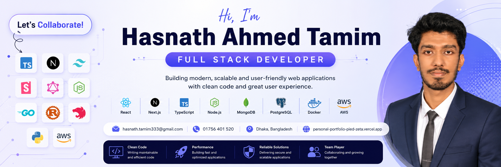

<!-- Banner -->

 

  <ul align="center">
    

      <h1 style="display: inline-block">
        Hi 👋, I'm Hasnath Ahmed Tamim
      </h1>
    

  
  </ul>

 

## 👨‍💻 ABOUT ME

- 💻 Junior Software Engineer with professional experience building modern Full-Stack applications.
- 🏢 Previously worked as a **Junior Software Engineer at Fiber@Home Ltd.**
- 🚀 Former **Intern Developer at Itransition Group**.
- 🌱 Currently exploring **System Design, Docker, Prisma, PostgreSQL and Cloud Technologies**.
- ⚙️ Building scalable applications using **React.js, Next.js, Node.js and TypeScript**.
- 🧠 Strong understanding of **REST APIs, Authentication, Database Design and Software Architecture**.
- 📚 Pursuing **Professional Masters in Information Technology** at Jahangirnagar University.
- 🎓 B.Sc. in Computer Science & Engineering from East West University.
- 📍 Dhaka, Bangladesh.
- 💬 Ask me about **React, Next.js, Node.js, TypeScript, MongoDB and Full-Stack Development**.
- 📫 Reach me at **hasnath.tamim333@gmail.com**.

 

## 🚀 CURRENT FOCUS

- 🔭 Building Full-Stack SaaS and Real-Time Applications.
- 🌱 Learning **Prisma ORM, PostgreSQL, Docker and System Design**.
- ⚽ Developing Football Management and Prediction Platforms.
- 📖 Solving JavaScript and Data Structure problems.
- 🤝 Looking for opportunities as a **Software Engineer / Full Stack Developer**.

 

## 🌐 PORTFOLIO & RESUME

- 🌍 Portfolio: https://personal-portfolio-pied-zeta.vercel.app/
- 💼 LinkedIn: https://www.linkedin.com/in/hasnath-ahmed-tamim/
- 📄 Resume: Add Google Drive Resume Link Here
- 📧 Email: hasnath.tamim333@gmail.com

 

## 🤝 CONNECT WITH ME

 

# 💻 TECHNOLOGY STACK

### Languages

### Frontend

### Backend

### Databases

### Cloud & Deployment

### Tools

 

# 🚀 FEATURED PROJECTS

### ⚽ FC26 Auction
Real-time fantasy football auction platform with live bidding and tournament management.

### 🏆 FIFA Prediction League
Football prediction platform with leaderboard, admin panel and automated scoring.

### ✅ Task Tracker App
Full-stack task management application with JWT authentication and real-time updates.

### 📚 Bookshop Management System
Online bookstore with inventory management and REST API integration.

 

# 📊 GITHUB STATISTICS & ANALYSIS

### Contribution Graph

### GitHub Statistics

| Stats | Languages |
| ----- | ----- |
|  |  |

### Streak & Contributions

| Streak | Contribution Stats |
| ----- | ----- |
|  |  |

 

# 🏆 ACHIEVEMENTS

- 🎓 B.Sc. in Computer Science & Engineering
- 📖 Published Research Paper on Green Cloud Computing and Machine Learning.
- 💼 Professional experience at Fiber@Home Ltd.
- 🚀 Built multiple Full-Stack applications and deployed production-ready projects.

 

# ✍️ RANDOM DEV QUOTE

---

<h3 align="center">
Code • Learn • Build • Repeat 🚀
</h3>
