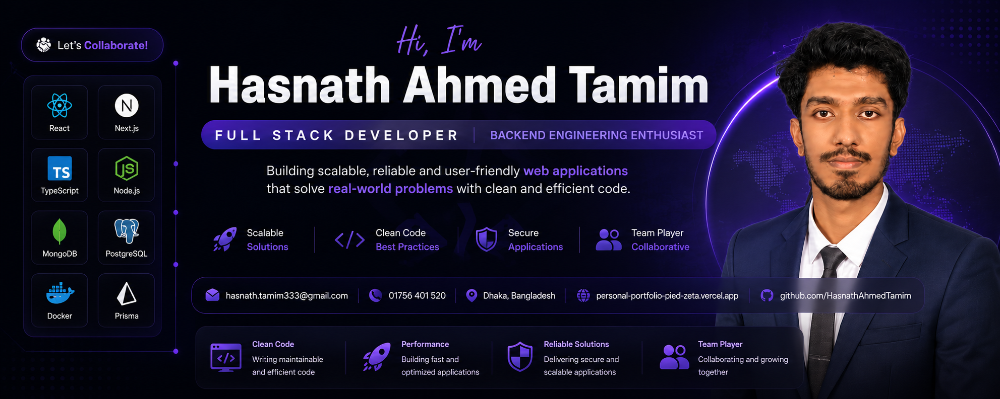

<!-- ==================== BANNER ==================== -->

  

 

<!-- ==================== INTRODUCTION ==================== -->

# Hi 👋, I'm Hasnath Ahmed Tamim

### Full Stack Developer | Junior Software Engineer

 

📍 Dhaka, Bangladesh •
📧 <a href="mailto:hasnath.tamim333@gmail.com">hasnath.tamim333@gmail.com</a>

  

---

# 👨‍💻 ABOUT ME

- 💻 Full Stack Developer building modern, scalable, and production-ready web applications.
- 🚀 Former **Junior Software Engineer at Fiber@Home Ltd.** and **Intern Developer at Itransition Group**.
- ⚙️ Working with **React, Next.js, Node.js, TypeScript, MongoDB, PostgreSQL, and Prisma**.
- 🌱 Currently exploring **System Design, Docker, Backend Architecture, and Cloud Technologies**.
- ⚽ Football enthusiast who enjoys building **sports-tech platforms and real-time applications**.
- 🎯 Interested in **Backend Engineering, Scalable Systems, and SaaS Product Development**.

📄 [Resume](https://drive.google.com/file/d/1KYyiBivlo0a4HdU9RAZKBviHQZCGfAT3/view)
•
💼 [LinkedIn](https://www.linkedin.com/in/hasnath-ahmed-tamim/)
•
🌐 [Portfolio](https://personal-portfolio-pied-zeta.vercel.app/)
•
📧 [Contact Me](mailto:hasnath.tamim333@gmail.com)

 

---

# ⚡ CURRENT FOCUS

  

- 🔭 Building **Full Stack SaaS and Real-Time Applications**.
- 🌱 Learning **Prisma ORM, PostgreSQL, Docker, and System Design**.
- ⚽ Developing **Football Management and Prediction Platforms**.
- 📚 Practicing **Data Structures and Algorithms**.
- 🚀 Exploring **Backend Architecture and Cloud Technologies**.

 

---

# 🤝 CONNECT WITH ME

  

  

  

  

  

  

  

  

---

# 🛠️ TECHNOLOGY STACK

### Languages

### Frontend

### Backend

### Database & ORM

### Deployment & Cloud

### Tools & Technologies

---

# 💼 PROFESSIONAL EXPERIENCE

## Junior Software Engineer

### Fiber@Home Ltd.

📅 **Dec 2025 – Jun 2026**

- Developed frontend and backend features using **React.js, Next.js, TypeScript, and Node.js**.
- Designed and integrated **RESTful APIs** supporting multiple application modules.
- Collaborated with cross-functional teams to deliver production-ready software.
- Contributed to Android application development using **Kotlin and Jetpack Compose**.

---

## Intern Developer

### Itransition Group

📅 **Apr 2025 – Aug 2025**

- Built multiple **React applications** and completed JavaScript-focused development assignments.
- Worked on frontend and backend development tasks.
- Gained practical experience in **API integration and database design**.

---

# 🚀 FEATURED PROJECTS

## ⚽ [FC26 Auction](https://fc26-test-auctions.vercel.app/)

A real-time fantasy football auction platform featuring **live bidding, squad management, tournament fixtures, lineup management, and role-based administration**.

  

[🌐 Live Application](https://fc26-test-auctions.vercel.app/)
•
[📂 GitHub Repository](https://github.com/HasnathAhmedTamim/fc26-test-auctions)

---

## 🏆 [FIFA Prediction League](https://client-kappa-eight-62.vercel.app/)

A football prediction platform featuring **automated scoring, knockout qualification logic, role-based administration, and real-time leaderboards**.

  

[🌐 Live Application](https://client-kappa-eight-62.vercel.app/)
•
[📂 GitHub Repository](https://github.com/HasnathAhmedTamim/fifa-worldcup-prediction-frontend26)

---

## 🏋️ [GearUp Backend API](https://b7a4-gearup-backend-assignment.onrender.com/)

A role-based backend API for a sports and outdoor equipment rental platform featuring **JWT authentication, Stripe payments, rental management, reviews, and RBAC**.

  

[🌐 Live API](https://b7a4-gearup-backend-assignment.onrender.com/)
•
[📂 GitHub Repository](https://github.com/HasnathAhmedTamim/B7A4-GearUp-Backend-Assignment)

---

## ⚽ [FPL News Portal](https://fpl-news-portal-nextjs.vercel.app/)

A Fantasy Premier League news and analytics platform featuring **FPL news, player analysis, points calculator, fixture difficulty tools, and a responsive modern interface**.

  

[🌐 Live Application](https://fpl-news-portal-nextjs.vercel.app/)
•
[📂 GitHub Repository](https://github.com/HasnathAhmedTamim/fpl-news-portal-nextjs)

---

## 🚀 [Personal Portfolio](https://personal-portfolio-pied-zeta.vercel.app/)

A responsive personal portfolio showcasing my **projects, technical skills, professional experience, research publication, and software engineering journey**.

  

[🌐 Live Website](https://personal-portfolio-pied-zeta.vercel.app/)
•
[📂 GitHub Repository](https://github.com/HasnathAhmedTamim/personal-portfolio)

---

## 📚 [Bookshop Management System](https://lovely-selkie-1c53f7.netlify.app/)

A full-stack online bookstore featuring **inventory management, Firebase authentication, REST APIs, MongoDB integration, and a responsive user interface**.

  

[🌐 Live Application](https://lovely-selkie-1c53f7.netlify.app/)
•
[📂 GitHub Repository](https://github.com/HasnathAhmedTamim/simple-bookshop-management-client)

---

# 📖 RESEARCH & PUBLICATIONS

### [Effective Fault Prediction Techniques for Green Cloud Computing Environments Using Machine Learning](https://link.springer.com/chapter/10.1007/978-3-031-36246-0_15)

Published research exploring **machine-learning-based fault prediction techniques for Green Cloud Computing environments**.

📄 [View Publication](https://link.springer.com/chapter/10.1007/978-3-031-36246-0_15)

---

# 🏆 ACHIEVEMENTS

- 💼 Professional experience as a **Junior Software Engineer**.
- 📖 Published research in **Machine Learning and Green Cloud Computing**.
- 🎓 B.Sc. in **Computer Science & Engineering**.
- 📚 Pursuing a **Professional Masters in Information Technology**.
- 🚀 Built and deployed multiple **Full Stack and Backend applications**.

---

# 🎯 2026 GOALS

- 🌍 Contribute to **Open Source**.
- 🏗️ Deep dive into **System Design**.
- 🚀 Build scalable **SaaS applications**.
- ⚙️ Strengthen **Backend Engineering** skills.
- ☁️ Learn **Cloud and DevOps fundamentals**.
- 📈 Continuously grow as a **Software Engineer**.

---

# 🐍 CONTRIBUTION SNAKE

  <picture>
    <source
      media="(prefers-color-scheme: dark)"
      srcset="https://raw.githubusercontent.com/HasnathAhmedTamim/HasnathAhmedTamim/output/github-contribution-grid-snake-dark.svg"
    />
    <source
      media="(prefers-color-scheme: light)"
      srcset="https://raw.githubusercontent.com/HasnathAhmedTamim/HasnathAhmedTamim/output/github-contribution-grid-snake.svg"
    />
    
  </picture>

---

# 📊 GITHUB STATISTICS & ANALYSIS

### 🔥 Contribution Streak

  

### 📈 Contribution Activity

  

---

# 💡 PHILOSOPHY

> Build software that solves real problems, write clean code, and never stop learning.
>
> And yes, I occasionally treat debugging like an extreme sport. 😄

---

### 🚀 Open to Software Engineer & Full Stack Developer Opportunities

I'm interested in opportunities where I can contribute to building **scalable web applications, backend systems, and meaningful software products**.

📧 **[hasnath.tamim333@gmail.com](mailto:hasnath.tamim333@gmail.com)**

🌐 **[Portfolio](https://personal-portfolio-pied-zeta.vercel.app/)**
•
💼 **[LinkedIn](https://www.linkedin.com/in/hasnath-ahmed-tamim/)**
•
📄 **[Resume](https://drive.google.com/file/d/1KYyiBivlo0a4HdU9RAZKBviHQZCGfAT3/view)**

 

### Code • Learn • Build • Repeat 🚀

