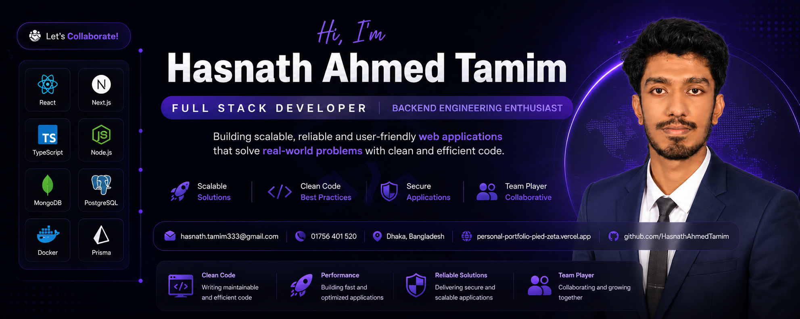

<!-- ==================== BANNER ==================== -->

  

 

<!-- ==================== INTRODUCTION ==================== -->

# Hi 👋, I'm Hasnath Ahmed Tamim

### Software Developer | Full Stack (React · Next.js · Node.js)

 

📍 Dhaka, Bangladesh · Open to full-time / remote opportunities  
📧 <a href="mailto:hasnath.tamim333@gmail.com">hasnath.tamim333@gmail.com</a>

  

---

# 👨‍💻 ABOUT ME

- 💻 Software Developer building modern, scalable, production-ready web applications.
- 🚀 Experience as **Junior Software Intern Engineer at Fiber@Home Ltd.** and **Intern Developer at Itransition Group**.
- ⚙️ Working with **React, Next.js, TypeScript, Node.js, PostgreSQL, MongoDB, and Prisma**.
- 🌱 Currently exploring **System Design, Docker, Backend Architecture, and Cloud Technologies**.
- ⚽ Football enthusiast who enjoys building **sports-tech platforms and real-time applications**.
- 🎯 Interested in **Full Stack Development, Backend Engineering, and SaaS products**.

📄 [Resume](https://drive.google.com/file/d/1Awei2dykg94-jn7xo2IGlyS5qd7yfX8A/view?usp=sharing)
•
💼 [LinkedIn](https://www.linkedin.com/in/hasnath-ahmed-tamim/)
•
🌐 [Portfolio](https://personal-portfolio-pied-zeta.vercel.app/)
•
📧 [Contact Me](mailto:hasnath.tamim333@gmail.com)

 

---

# ⚡ CURRENT FOCUS

  

- 🔭 Building **Full Stack SaaS and Real-Time Applications**.
- 🌱 Strengthening **Prisma, PostgreSQL, Docker, and System Design**.
- ⚽ Developing **Football Management and Prediction Platforms**.
- 📚 Practicing **Data Structures and Algorithms**.
- 🚀 Exploring **Backend Architecture and Cloud Fundamentals**.

 

---

# 🤝 CONNECT WITH ME

  

  

  

  

  

  

  

  

---

# 🛠️ TECHNOLOGY STACK

### Languages

### Frontend

### Backend

### Database & ORM

### Deployment & Cloud

### Tools

**Also:** JWT Authentication · RBAC · REST APIs · MVC · Stripe · Zod · TanStack Query

---

# 💼 PROFESSIONAL EXPERIENCE

## Junior Software Intern Engineer

### Fiber@Home Ltd.

📅 **Dec 2025 – Jun 2026**

- Developed and maintained responsive full-stack features using **React.js, Next.js, TypeScript, and Node.js**.
- Built and integrated **RESTful APIs** to support frontend and backend workflows.
- Collaborated with teams to deliver production-ready software.
- Contributed to Android development using **Kotlin and Jetpack Compose**.

---

## Intern Developer

### Itransition Group

📅 **Apr 2025 – Aug 2025**

- Built **5+ React.js** mini projects focused on frontend development.
- Worked with component-based architecture, API integration, and responsive UI.
- Gained practical experience in **backend integration and database design**.

---

# 🚀 FEATURED PROJECTS

## 🏕️ [GearUp – Sports & Outdoor Gear Rental](https://b7-a5-gear-up-frontend-assignment.vercel.app/)

Full-stack rental platform with **Customer / Provider / Admin** dashboards, JWT auth, Stripe Checkout, rental & inventory management, and review system.

  

[🌐 Live App](https://b7-a5-gear-up-frontend-assignment.vercel.app/)
•
[📂 Frontend](https://github.com/HasnathAhmedTamim/B7A5-GearUp-Frontend-Assignment-)
•
[⚙️ Backend](https://github.com/HasnathAhmedTamim/B7A4-GearUp-Backend-Assignment)

---

## 🎓 [Student Management Dashboard](https://student-management-dashboard-inky-kappa.vercel.app/)

Admin dashboard to **search, filter, sort, paginate, create, update, and delete** students — with auth, Zod validation, Redux Toolkit, Prisma, and PostgreSQL.

  

[🌐 Live App](https://student-management-dashboard-inky-kappa.vercel.app/)
•
[📂 GitHub Repository](https://github.com/HasnathAhmedTamim/student-management-dashboard)

> Demo login: `admin` / `admin123`

---

## ⚽ [FC26 Auction](https://fc26-test-auctions.vercel.app/)

Real-time fantasy football auction platform with **live bidding, squad management, tournament fixtures, and role-based administration**.

  

[🌐 Live Application](https://fc26-test-auctions.vercel.app/)
•
[📂 GitHub Repository](https://github.com/HasnathAhmedTamim/fc26-test-auctions)

---

## 🏆 [FIFA Prediction League](https://client-kappa-eight-62.vercel.app/)

Football prediction platform with **automated scoring, knockout logic, admin panel, and real-time leaderboards**.

  

[🌐 Live Application](https://client-kappa-eight-62.vercel.app/)
•
[📂 GitHub Repository](https://github.com/HasnathAhmedTamim/fifa-worldcup-prediction-frontend26)

---

## 📰 [FPL News Portal](https://fpl-news-portal-nextjs.vercel.app/)

Fantasy Premier League hub with **news, player analysis, points calculator, fixture difficulty tools, and responsive UI**.

  

[🌐 Live Application](https://fpl-news-portal-nextjs.vercel.app/)
•
[📂 GitHub Repository](https://github.com/HasnathAhmedTamim/fpl-news-portal-nextjs)

---

## 🚀 [Personal Portfolio](https://personal-portfolio-pied-zeta.vercel.app/)

Developer portfolio showcasing **projects, skills, experience, research, and software engineering journey**.

  

[🌐 Live Website](https://personal-portfolio-pied-zeta.vercel.app/)
•
[📂 GitHub Repository](https://github.com/HasnathAhmedTamim/personal-portfolio)

---

# 🎓 EDUCATION

- **Professional Masters in Information Technology** — Jahangirnagar University *(May 2024 – Present)* · CGPA **3.94**
- **B.Sc. in Computer Science & Engineering** — East West University *(Jan 2019 – Dec 2023)* · CGPA **3.23**

---

# 📖 RESEARCH & PUBLICATIONS

### [Effective Fault Prediction Techniques for Green Cloud Computing Environments Using Machine Learning](https://link.springer.com/chapter/10.1007/978-3-031-36246-0_15)

Published research on **machine-learning-based fault prediction for Green Cloud Computing environments**. Springer, 2023.

📄 [View Publication](https://link.springer.com/chapter/10.1007/978-3-031-36246-0_15)

---

# 🏆 HIGHLIGHTS

- 💼 Internship experience in full-stack web and Android feature development
- 🚀 Shipped multi-role apps with **auth, payments, dashboards, and live demos**
- 📖 Published research in **Machine Learning and Green Cloud Computing**
- 🎓 Strong academic track: Masters CGPA **3.94**, CSE background
- 🛠️ Comfortable across **frontend, APIs, databases, and deployment**

---

# 🎯 2026 GOALS

- 🌍 Contribute to **Open Source**
- 🏗️ Deep dive into **System Design**
- 🚀 Build scalable **SaaS applications**
- ⚙️ Strengthen **Backend Engineering** skills
- ☁️ Learn **Cloud and DevOps fundamentals**
- 📈 Grow as a **Software Engineer**

---

# 🐍 CONTRIBUTION SNAKE

  <picture>
    <source
      media="(prefers-color-scheme: dark)"
      srcset="https://raw.githubusercontent.com/HasnathAhmedTamim/HasnathAhmedTamim/output/github-contribution-grid-snake-dark.svg"
    />
    <source
      media="(prefers-color-scheme: light)"
      srcset="https://raw.githubusercontent.com/HasnathAhmedTamim/HasnathAhmedTamim/output/github-contribution-grid-snake.svg"
    />
    
  </picture>

---

# 📊 GITHUB STATISTICS

### Contribution Streak

  

### Contribution Activity

  

### Stats & Top Languages

  
  

---

# 💡 PHILOSOPHY

> Build software that solves real problems, write clean code, and never stop learning.
>
> And yes, I occasionally treat debugging like an extreme sport. 😄

---

### 🚀 Open to Software Developer & Full Stack Opportunities

I want to contribute to **scalable web applications, clean APIs, and meaningful products**.

📧 **[hasnath.tamim333@gmail.com](mailto:hasnath.tamim333@gmail.com)**

🌐 **[Portfolio](https://personal-portfolio-pied-zeta.vercel.app/)**
•
💼 **[LinkedIn](https://www.linkedin.com/in/hasnath-ahmed-tamim/)**
•
📄 **[Resume](https://drive.google.com/file/d/1Awei2dykg94-jn7xo2IGlyS5qd7yfX8A/view?usp=sharing)**

 

### Code • Learn • Build • Repeat 🚀

